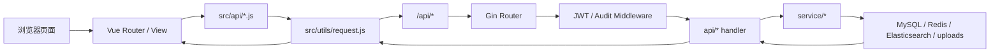

# GVB 前后端总览

## 1. 仓库分工

整个系统由两个仓库组成：

| 仓库 | 作用 |
| --- | --- |
| [`../README.md`](../README.md) | 后端服务 `gvb_server`，提供 API、鉴权、搜索、实时通信、资源访问控制和后台管理能力。 |
| [`../../gvb_vue/README.md`](../../gvb_vue/README.md) | 前端项目 `gvb_vue`，提供前台社区界面和后台运营界面。 |

一句话理解：

- 前端负责“页面、状态、交互”。
- 后端负责“接口、权限、数据、实时事件”。

## 2. 一条请求怎么走完



你在代码里通常会沿着这条链路排查问题：

`页面 -> API 封装 -> 请求层 -> 后端路由 -> handler -> service -> model`

## 3. 两端目录如何对应

| 前端位置 | 后端位置 | 关系 |
| --- | --- | --- |
| `src/router/index.js` | `routers/*.go` | 一个负责页面路径，一个负责接口路径。 |
| `src/views/front/*.vue` | `api/*_api` + `service/*` | 前台页面调用后端业务模块。 |
| `src/views/admin/*.vue` | `routers/*_router.go` | 后台页面基本一一映射到后台 API 模块。 |
| `src/api/*.js` | `routers/*.go` | 前端 API 文件通常直接对应某个后端路由组。 |
| `src/stores/user.js` | `middleware/jwt_auth.go` + `api/user_api` | 前端登录态与后端 JWT 鉴权配合。 |
| `src/stores/social.js` | `routers/social_router.go` + `api/social_api` | 实时消息、好友系统、群组、WebRTC。 |

## 4. 核心业务模块总表

| 业务域 | 前端入口 | 前端 API 文件 | 后端路由 | 核心存储 |
| --- | --- | --- | --- | --- |
| 站点首页与导航 | `FrontLayout.vue` `HomeView.vue` | `menu.js` `system.js` `announcement.js` | `menu_router.go` `settings_router.go` `announcement_router.go` `data_router.go` | MySQL |
| 文章系统 | `HomeView.vue` `BoardDetailView.vue` `ArticleDetailView.vue` `ArticleEditView.vue` | `article.js` `comment.js` | `article_router.go` `comment_router.go` `digg_router.go` `file_router.go` | Elasticsearch + MySQL |
| 搜索与资讯 | `SearchView.vue` `NewsView.vue` | `article.js` `system.js` | `article_router.go` `new_router.go` | Elasticsearch + 外部资讯源 |
| 登录与用户 | `LoginView.vue` `RegisterView.vue` `ProfileView.vue` `UserSpaceView.vue` | `user.js` | `user_router.go` | MySQL + Redis |
| 社交与私信 | `PrivateMessageView.vue` | `social.js` `message.js` | `social_router.go` `message_router.go` | MySQL + WebSocket |
| 语音通话 | `PrivateMessageView.vue` + `stores/social.js` | `social.js` | `social_router.go` `/api/social/ws` | WebSocket + WebRTC |
| 社区广场与赏金 | `CommunityHubView.vue` `CommunityPostDetailView.vue` | `social.js` | `social_router.go` | MySQL |
| 图片与附件 | `ImageManageView.vue` `ArticleEditView.vue` | `image.js` `article.js` `social.js` | `images_router.go` `file_router.go` `social_router.go` | uploads + MySQL |
| 后台运营与配置 | `AdminLayout.vue` 下各管理页面 | `system.js` `user.js` `tag.js` `board.js` `menu.js` `advert.js` `announcement.js` | 多个 `*_router.go` | MySQL + ES |

## 5. 关键链路说明

### 5.1 登录与权限

前端：

- 登录后把 token 存进 `localStorage`。
- [`../../gvb_vue/src/utils/request.js`](../../gvb_vue/src/utils/request.js) 会自动把 token 写到请求头。
- [`../../gvb_vue/src/router/index.js`](../../gvb_vue/src/router/index.js) 根据 `requiresAuth` 和 `requiresAdmin` 做页面拦截。

后端：

- [`../middleware/jwt_auth.go`](../middleware/jwt_auth.go) 解析 JWT。
- Redis 黑名单用于处理退出登录后的 token 失效。
- 管理员接口统一走 `JwtAdmin()`。

### 5.2 文章发布、审核、搜索

主要链路：

1. 后台编辑页 `ArticleEditView.vue` 调用 `apiCreateArticle` 或 `apiUpdateArticle`。
2. 前端 API 进入 `/api/articles`。
3. 后端 `article_router.go -> api/article_api -> service/es_ser`。
4. 文章正文与检索结构主要落在 Elasticsearch。
5. 评论、收藏、举报、审核状态等通过其他 MySQL 模型补充。

这意味着：

- 查“为什么搜不到文章”，先看 ES。
- 查“为什么评论数不对”，再看 MySQL 的评论与统计同步链路。

### 5.3 私信、群组、在线状态、语音

主要链路：

1. 用户进入 `PrivateMessageView.vue`。
2. 页面通过 `socialStore.ensureStarted()` 拉基础数据并启动 WebSocket。
3. WebSocket 连接到 `/api/social/ws`。
4. 后端通过 `social_router.go` 和 `api/social_api` 推送实时消息。
5. 语音通话信令仍走 WebSocket，真实音频流走 WebRTC。

前端 `stores/social.js` 负责：

- socket 生命周期
- 消息刷新信号
- 在线状态局部更新
- WebRTC offer/answer/candidate 协商

后端 `models/social_model.go` 负责持久化：

- 好友关系
- 黑名单
- 群组与成员
- 消息记录
- 会话已读游标
- 通话日志

### 5.4 社区广场与赏金大厅

前端：

- `CommunityHubView.vue` 同时承载广场和赏金两个场景。
- 路由通过 `meta.scene` 区分 `plaza` 和 `bounty`。

后端：

- 统一走 `/api/social/community/*`。
- [`../models/community_model.go`](../models/community_model.go) 中 `Scene` 和 `Status` 决定帖子语义。

可以这样理解：

- `plaza` 是普通交流帖。
- `bounty` 是带预算、截止时间、接单状态的任务帖。

### 5.5 图片、附件与访问控制

前端：

- 图片上传主要走 `image.js`。
- 文章和社交文件分别走 `article.js` 和 `social.js` 的文件上传接口。

后端：

- `/uploads/*` 并不是无权限直出。
- [`../routers/enter.go`](../routers/enter.go) 会拦截受保护路径并校验私有图片所有者。
- 文章附件和社交文件都提供独立下载接口。

所以资源问题一般分三类排查：

- 路径拼错
- 权限不足
- 数据库中资源元信息和磁盘文件不一致

## 6. 本地联调步骤

### 6.1 启动后端

在 `gvb_server` 目录下：

```bash
go run .
```

默认地址：

- API: `http://localhost:8080`
- Swagger: `http://localhost:8080/swagger/index.html#/`

### 6.2 启动前端

在 `gvb_vue` 目录下：

```bash
npm install
npm run dev
```

默认地址：

- 前端: `http://localhost:3000`

开发代理会把：

- `/api` 转发到 `http://localhost:8080`
- `/uploads` 转发到 `http://localhost:8080`

### 6.3 联调时建议优先验证的页面

1. 首页 `/`
2. 登录 `/login`
3. 后台 `/admin/dashboard`
4. 文章详情 `/article/:id`
5. 私信 `/messages`
6. 社区广场 `/community`

这几页覆盖了最主要的接口、鉴权、资源访问和实时能力。

## 7. 推荐阅读顺序

### 如果你从前端入手

1. `gvb_vue/src/router/index.js`
2. `gvb_vue/src/layouts/FrontLayout.vue`
3. `gvb_vue/src/views/front/HomeView.vue`
4. `gvb_vue/src/api/article.js`
5. `gvb_server/routers/article_router.go`
6. `gvb_server/api/article_api`

### 如果你从后端入手

1. `gvb_server/main.go`
2. `gvb_server/routers/enter.go`
3. 目标模块 `gvb_server/routers/*_router.go`
4. 对应 `gvb_server/api/*_api`
5. 对应 `gvb_server/service/*`
6. 对应 `gvb_server/models/*`

## 8. 当前项目里几个容易混淆的点

- 文章主体在 Elasticsearch，不是纯 MySQL 项目。
- 社交模块不是只有私信，还包含好友、群组、在线状态、社区帖子和语音通话。
- 后台配置页不仅是改站点标题，还包含 ES 导入导出、抓取文章和图片同步。
- 一些接口保留了历史兼容命名，比如 `categorys`、`messages_record`、`SettinsRouter`，阅读时以当前路由文件为准。
- 前端 `src/api/chat.js` 中存在 `apiCreateChatGroup`，但当前后端路由层主要暴露的是聊天室读取接口，联调时请以 `routers/chat_router.go` 为准。

## 9. 配套文档索引

前端侧：

- [`../../gvb_vue/README.md`](../../gvb_vue/README.md)
- [`../../gvb_vue/FRONTEND_BEGINNER_GUIDE.md`](../../gvb_vue/FRONTEND_BEGINNER_GUIDE.md)
- [`../../gvb_vue/API_DOCUMENTATION.md`](../../gvb_vue/API_DOCUMENTATION.md)

后端侧：

- [`../README.md`](../README.md)
- [`../BACKEND_BEGINNER_GUIDE.md`](../BACKEND_BEGINNER_GUIDE.md)
- [`../API_DOCUMENTATION.md`](../API_DOCUMENTATION.md)
- [`./swagger.yaml`](./swagger.yaml)
- [`./GVB_Server.postman_collection.json`](./GVB_Server.postman_collection.json)

## 10. 一句话总结

这个系统最适合这样理解：

前端用 Vue 把内容社区、社交实时和后台运营三套界面组织起来，后端用 Gin 把接口、权限、MySQL、Redis、Elasticsearch 和文件访问控制串成一条完整业务链路。
